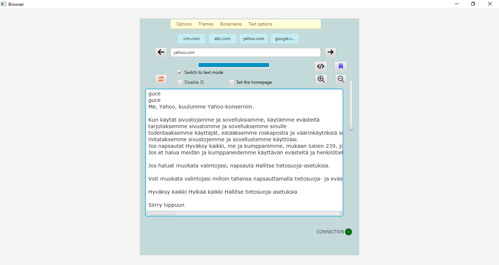

Project keywords: Java, Lynx clone, webbrowser clone, WebView,MySQL

This program emulates two types of programs, a modern web browser and a Lynx-style browser that only displays
the text of the web page the user is looking for.

WebView

Text View

MAIN FEATURES

UI & UX

The user interface is made with Gluon's SceneBuilder. Most of the buttons have 16 and 24 pixel icons and the icons
are downloaded from www.flaticon.com. The user interface has a progress bar that fills only when the page has fully loaded. 
the loading of the page is controlled by the Worker State object. The idea behind this is to give the user a visual idea 
that the page is completely ready to use.

WebView Browser

The program has a text field where you can write the desired url address. Once the address is written, press Enter to go to the page.
The method implementing the display of the url page receives as a parameter the keyEvent handler, i.e. the press of the enter key.
The address entered by the user is stored in a variable and is sent to the load method of the WebView class.
The end result is the display of the user's desired website in the program's user interface window.

Lynx clone browser

The Lynx browser displays web pages in text mode only. If the user wants to see only the text of web pages, this feature can be enabled
by clicking the "Switch to text mode" checkbox in the user interface. The  Checkbox works dynamically. One click hides the webView element
and shows the text area. a second click does the opposite.
By clicking the checkbox, the program hides the webView element using the SetOpacity method and displays the 
text area element using the same method. The text fetched from the url is displayed in the text area element.

Searching for plain text from the url entered by the user is done with the ExcecuteScript method of the WenView class, 
which takes the expression "document.documentElement.innerText" as a value. The text content of the page can also be 
saved in a text file. The save method contains a dialog where the user can select a folder/location to save the file.
This feature is implemented in the FileChooser and FileWriter classes.

DISABLE AND ENABLE JAVASCRIPT

JavaScript can be enabled and disabled by clicking the checkbox. if the checkbox is checked, the method executes 
webView.getEngine().setJavaScriptEnabled(false) command. if the method's checkbox is unchecked, the method will change
the Boolean value to true.

SHOW PAGE SOURCE CODE

By clicking the source code button, the program hides the webview element and shows the textarea element using the SetOpacity method.
Then the source code of the retrieved page is displayed in the textarea element in its entirety.
The source code is obtained by the ExecuteScript method, which contains the command "document.documentElement.outerHTML".

The source code button works dynamically, one click hides the webview and shows the text area and another click does the opposite.
The dynamism is done with the public int clicks variable. Each time the source code button is clicked, the click variable is incremented by one.
Then the function is controlled with a division remainder and an if statement. if the result is divisible by 1, the first if the branch is 
executed, and if the result is divisible by 2, the second if the branch is executed.

BOOKMARKS

Bookmarks can be saved by clicking the Save Bookmark button. The button's method retrieves the typed address 
from the address field and stores it in the SQL database.

Saved bookmarks appear in the Bookmarks menu. Clicking on the bookmark menu executes a method that creates a 
menuitem item for each saved bookmark stored in the program's sql database.
In each menu item, you can access the url address of the menu item by clicking on the desired address. 
Each menu item has an event handler that grabs the URL of the clicked menu item and sends it to the WebView object.
Then the webView object performs the loading method, i.e. displays the page of the clicked bookmark.

SET THE HOMEPAGE

Like modern browsers, you can set your favorite page as the home page that appears every time you open the program.
The program's user interface has a set home page check box. By clicking the check box, the program executes a method 
that first checks if the favorite home page is already stored in the SQL database used by the program, if found, an SQL update query is executed. 
If not, the SQL insert query is executed. Since the table only has one value at a time, I used the isBeforeFirst method and
SELECT * FROM pages ORDER BY id DESC LIMIT 1" -SQL clause to check the table.

THEMES

The program includes two ready-made themes, light and dark, which can be used to change the appearance of the browser.
In addition, the user can enter the desired color code in the input field as a HEX code and the color of the appearance 
will change accordingly to the color code provided by the user.
The selected theme is always saved in a text file, so the program remembers the last used and saved theme.
Since the stored value is small, I decided to use a text file instead of a database.

Theme values ​​are stored in the settings.txt file. First, the program checks if the configuration file already exists, 
if not, the program creates it and if it exists, replaces the theme with the new value.
These properties are done using the File class and the FileWriter class.
Style changes are implemented with the setStyle method.

ZOOM

When the user uses the webView browser, the content can be zoomed in and out by pressing the buttons.The feature is made using 
the setZoom method of the WebView class.
On each click, the SetZoom method receives a decimal value of 1.0 as a parameter, and depending on whether the user has pressed 
the Zoom In or Zoom Out button, the value returned as a parameter is either increased or decreased from its current zoom value.
The current zoom value is obtained with the getZoom method.

CHANGE THE FONT SCALE

the font size can be changed using the slider. drag the slider up to increase the font size and drag the slider down to 
decrease the font size. The slider component uses the changeListener interface to determine the current value of the slider.
The font scale can be reset to the default value by clicking the reset button. when you click the reset button, the button
method sends a value of 0.0 to the slider.setValue method and a value of 1.0 to the webView.setScale method.

GO PREVIOUS OR NEXT PAGE

All URLs that the user types in the address field are stored in a list of strings. When the user wants to go to the previous page, 
the method implementing this function uses a variable whose value is always reduced by one with each click. 
Then the load method of the webview class is given the address list and the aforementioned variable as parameters. 
In practice, therefore, the previous address is searched from the list.

When moving to the next page, the value of the variable is increased by one, i.e. the next address stored there is retrieved from the list.

